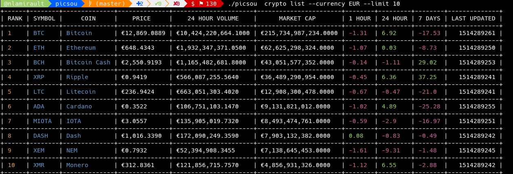
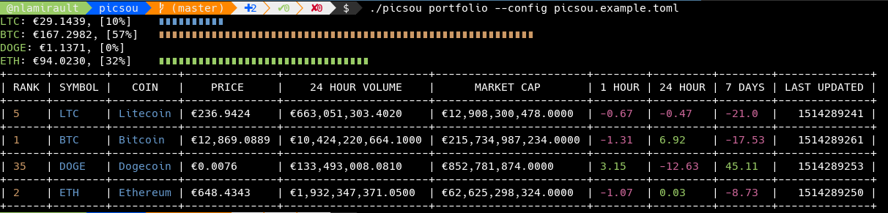

# Picsou

[![License Apache 2][badge-license]](LICENSE)
[](https://badge.fury.io/gh/nlamirault%2Fpicsou)

* Master : [](https://gitlab.com/nicolas-lamirault/picsou/commits/master)

* Develop : [](https://gitlab.com/nicolas-lamirault/picsou/commits/develop)


This tools is a CLI which cant display crypto currencies informations.
Available providers :

* [x] Coinmarketcap






## Installation

You can download the binaries :

* Architecture i386 [ [linux](https://bintray.com/artifact/download/nlamirault/oss/picsou-0.4.0_linux_386) / [darwin](https://bintray.com/artifact/download/nlamirault/oss/picsou-0.4.0_darwin_386) / [freebsd](https://bintray.com/artifact/download/nlamirault/oss/picsou-0.4.0_freebsd_386) / [netbsd](https://bintray.com/artifact/download/nlamirault/oss/picsou-0.4.0_netbsd_386) / [openbsd](https://bintray.com/artifact/download/nlamirault/oss/picsou-0.4.0_openbsd_386) / [windows](https://bintray.com/artifact/download/nlamirault/oss/picsou-0.4.0_windows_386.exe) ]
* Architecture amd64 [ [linux](https://bintray.com/artifact/download/nlamirault/oss/picsou-0.4.0_linux_amd64) / [darwin](https://bintray.com/artifact/download/nlamirault/oss/picsou-0.4.0_darwin_amd64) / [freebsd](https://bintray.com/artifact/download/nlamirault/oss/picsou-0.4.0_freebsd_amd64) / [netbsd](https://bintray.com/artifact/download/nlamirault/oss/picsou-0.4.0_netbsd_amd64) / [openbsd](https://bintray.com/artifact/download/nlamirault/oss/picsou-0.4.0_openbsd_amd64) / [windows](https://bintray.com/artifact/download/nlamirault/oss/picsou-0.4.0_windows_amd64.exe) ]
* Architecture arm [ [linux](https://bintray.com/artifact/download/nlamirault/oss/picsou-0.4.0_linux_arm) / [freebsd](https://bintray.com/artifact/download/nlamirault/oss/picsou-0.4.0_freebsd_arm) / [netbsd](https://bintray.com/artifact/download/nlamirault/oss/picsou-0.4.0_netbsd_arm) ]


## Usage

* CLI help:

        $ picsou help

* List crypto currencies:

        $ picsou crypto list
        +------+--------+-------------------------+--------------+----------------------+-----------------------+--------+---------+--------+--------------+
        | RANK | SYMBOL |          COIN           |  EUR PRICE   |    24 HOUR VOLUME    |      MARKET CAP       | 1 HOUR | 24 HOUR | 7 DAYS | LAST UPDATED |
        +------+--------+-------------------------+--------------+----------------------+-----------------------+--------+---------+--------+--------------+
        | 1    | BTC    | Bitcoin                 | €11,473.2375 | €10,629,779,512.0000 | €192,297,908,015.0000 | 0.57   | -11.11  | -30.48 |   1514129055 |
        +------+--------+-------------------------+--------------+----------------------+-----------------------+--------+---------+--------+--------------+
        | 2    | ETH    | Ethereum                | €560.7617    | €2,073,011,060.4500  | €54,136,718,951.0000  | 0.2    | -11.26  | -7.54  |   1514129059 |
        +------+--------+-------------------------+--------------+----------------------+-----------------------+--------+---------+--------+--------------+
        | 3    | BCH    | Bitcoin Cash            | €2,366.9523  | €1,755,375,736.9500  | €39,938,326,226.0000  | -0.82  | -17.23  | 50.8   |   1514128788 |
        +------+--------+-------------------------+--------------+----------------------+-----------------------+--------+---------+--------+--------------+
        | 4    | XRP    | Ripple                  | €0.8334      | €650,536,873.5250    | €32,286,485,475.0000  | 0.75   | -16.14  | 34.27  |   1514129041 |
        +------+--------+-------------------------+--------------+----------------------+-----------------------+--------+---------+--------+--------------+
        | 5    | LTC    | Litecoin                | €226.2513    | €1,009,923,492.6000  | €12,319,633,746.0000  | -0.11  | -11.59  | -16.28 |   1514129042 |
        +------+--------+-------------------------+--------------+----------------------+-----------------------+--------+---------+--------+--------------+
        | 6    | ADA    | Cardano                 | €0.3180      | €64,642,203.3125     | €8,243,988,863.0000   | 1.1    | -13.6   | -25.57 |   1514128797 |
        +------+--------+-------------------------+--------------+----------------------+-----------------------+--------+---------+--------+--------------+
        | 7    | MIOTA  | IOTA                    | €2.8779      | €228,179,705.0500    | €7,999,282,807.0000   | 0.87   | -16.3   | -5.7   |   1514128782 |
        +------+--------+-------------------------+--------------+----------------------+-----------------------+--------+---------+--------+--------------+


* Check a specific crypto currency:

        $ picsou crypto get --name BTC
        +------+--------+---------+--------------+----------------------+-----------------------+--------+---------+--------+--------------+
        | RANK | SYMBOL |  COIN   |  EUR PRICE   |    24 HOUR VOLUME    |      MARKET CAP       | 1 HOUR | 24 HOUR | 7 DAYS | LAST UPDATED |
        +------+--------+---------+--------------+----------------------+-----------------------+--------+---------+--------+--------------+
        | 1    | BTC    | Bitcoin | €11,518.5176 | €10,707,270,051.5000 | €193,056,828,081.0000 | 1.07   | -10.75  | -30.21 |   1514128755 |
        +------+--------+---------+--------------+----------------------+-----------------------+--------+---------+--------+--------------+

* Portfolio :

        $ picsou portfolio get --config picsou.example.toml
        Portfoloio: binance
        +--------+------------+------------+---------+--------------------------------------------------------+
        | SYMBOL |   PRICE    |   NUMBER   | PERCENT |                          VUE                           |
        +--------+------------+------------+---------+--------------------------------------------------------+
        | BTC    | 106.304608 |   0.013000 |      45 | ∎∎∎∎∎∎∎∎∎∎∎∎∎∎∎∎∎∎∎∎∎∎∎∎∎∎∎∎∎∎∎∎∎∎∎∎∎∎∎∎∎∎∎∎∎          |
        +--------+------------+------------+---------+--------------------------------------------------------+
        | DOGE   |   0.729303 | 150.000000 |       0 |                                                        |
        +--------+------------+------------+---------+--------------------------------------------------------+
        | ETH    | 127.423793 |   0.145000 |      54 | ∎∎∎∎∎∎∎∎∎∎∎∎∎∎∎∎∎∎∎∎∎∎∎∎∎∎∎∎∎∎∎∎∎∎∎∎∎∎∎∎∎∎∎∎∎∎∎∎∎∎∎∎∎∎ |
        +--------+------------+------------+---------+--------------------------------------------------------+
        Portfoloio: kucoin
        +--------+-----------+----------+---------+------------------------------------------------------------------------------------------------------+
        | SYMBOL |   PRICE   |  NUMBER  | PERCENT |                                                 VUE                                                  |
        +--------+-----------+----------+---------+------------------------------------------------------------------------------------------------------+
        | LTC    | 16.215015 | 0.123000 |     100 | ∎∎∎∎∎∎∎∎∎∎∎∎∎∎∎∎∎∎∎∎∎∎∎∎∎∎∎∎∎∎∎∎∎∎∎∎∎∎∎∎∎∎∎∎∎∎∎∎∎∎∎∎∎∎∎∎∎∎∎∎∎∎∎∎∎∎∎∎∎∎∎∎∎∎∎∎∎∎∎∎∎∎∎∎∎∎∎∎∎∎∎∎∎∎∎∎∎∎∎∎ |
        +--------+-----------+----------+---------+------------------------------------------------------------------------------------------------------+

        $ picsou portfolio status --config picsou.example.toml
        Portfoloio: binance
        +------+--------+----------+-------------+---------------------+-----------------------+--------+---------+--------+--------------+
        | RANK | SYMBOL |   COIN   |    PRICE    |   24 HOUR VOLUME    |      MARKET CAP       | 1 HOUR | 24 HOUR | 7 DAYS | LAST UPDATED |
        +------+--------+----------+-------------+---------------------+-----------------------+--------+---------+--------+--------------+
        | 1    | BTC    | Bitcoin  | €8,177.2775 | €7,989,847,012.6600 | €137,677,444,244.0000 | 0.97   | -8.5    | -7.17  |   1517382267 |
        +------+--------+----------+-------------+---------------------+-----------------------+--------+---------+--------+--------------+
        | 43   | DOGE   | Dogecoin | €0.0049     | €14,270,499.8639    | €549,376,750.0000     | 1.42   | -12.04  | -10.11 |   1517382241 |
        +------+--------+----------+-------------+---------------------+-----------------------+--------+---------+--------+--------------+
        | 2    | ETH    | Ethereum | €878.7848   | €3,620,585,877.8000 | €85,522,155,845.0000  | 1.52   | -6.76   | 9.76   |   1517382253 |
        +------+--------+----------+-------------+---------------------+-----------------------+--------+---------+--------+--------------+
        Portfoloio: kucoin
        +------+--------+----------+-----------+-------------------+---------------------+--------+---------+--------+--------------+
        | RANK | SYMBOL |   COIN   |   PRICE   |  24 HOUR VOLUME   |     MARKET CAP      | 1 HOUR | 24 HOUR | 7 DAYS | LAST UPDATED |
        +------+--------+----------+-----------+-------------------+---------------------+--------+---------+--------+--------------+
        | 7    | LTC    | Litecoin | €131.8294 | €408,197,184.0460 | €7,250,831,850.0000 | 1.16   | -8.12   | -8.16  |   1517382241 |
        +------+--------+----------+-----------+-------------------+---------------------+--------+---------+--------+--------------+


With this example portfolio:

```toml
# Picsou - Portfolio configuration file

currency = "EUR"

[portfolios]

    [portfolios.binance]
    BTC = "0.013"
    DOGE = "150"
    ETH = "0.145"

    [portfolios.kucoin]
    LTC = "0.123"
```


## Development

* Initialize environment

        $ make init

* Build tool :

        $ make build

* Launch unit tests :

        $ make test

## Contributing

See [CONTRIBUTING](CONTRIBUTING.md).


## License

See [LICENSE](LICENSE) for the complete license.


## Changelog

A [changelog](ChangeLog.md) is available


## Contact

Nicolas Lamirault <nicolas.lamirault@gmail.com>

[badge-license]: https://img.shields.io/badge/license-Apache2-green.svg?style=flat
